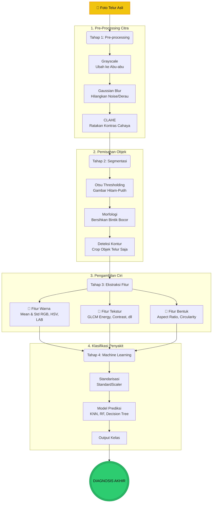

# 🐔 Identifikasi Kesehatan Unggas via Citra Telur
**Universitas Bina Sarana Informatika — Kelompok 3**

Program ini adalah purwarupa (prototype) sistem cerdas yang mampu mendeteksi kondisi kesehatan ayam petelur (seperti *stres panas, kurang kalsium, infeksi*, dll) hanya dengan menganalisis **foto cangkang telur** menggunakan algoritma **Pengolahan Citra Digital** dan **Machine Learning Klasik**.

---

## 📊 Alur Sistem (Pipeline Flowchart)

Berikut adalah diagram alir teknis (flowchart) dari program ini. Program bekerja memproses gambar secara bertahap dari kiri ke kanan:



---

## 🔬 Penjelasan Teknis Tiap Tahapan

### 1️⃣ Pre-processing (Pra-pemrosesan)
Tujuan tahap ini adalah untuk "menyiapkan" gambar agar mudah dibaca oleh komputer.
* **Grayscale**: Komputer lebih mudah memproses 1 channel intensitas cahaya dibanding 3 channel warna (RGB) secara bersamaan untuk mencari tepi objek.
* **Gaussian Blur**: Jika foto telur memiliki debu, bintik kasar kamera, atau pantulan cahaya, metode *blur* akan menghaluskannya sehingga tidak dianggap sebagai detail penting.
* **CLAHE (Contrast Limited Adaptive Histogram Equalization)**: Fitur yang sangat penting untuk foto asli! Metode ini akan mencerahkan bagian gambar yang terlalu gelap dan meredupkan bagian yang terlalu terang (seperti bayangan kamera).

*(Catatan: output pada program ini akan otomatis di-save per tahapan, misal: `_1_grayscale.png`)*

### 2️⃣ Segmentasi
Tujuan tahap ini adalah mencari letak telur dan membuang *background* (latar belakang) agar warna *background* tidak ikut dihitung.
* **Otsu Thresholding**: Komputer akan mencari nilai batas kecerahan secara otomatis. Semua yang di atas batas dijadikan warna Putih (dianggap objek), dan di bawahnya dijadikan Hitam (dianggap *background*).
* **Morfologi (Close & Open)**: Kadang thresholding tidak sempurna (ada bintik hitam di dalam telur, atau bintik putih di luar). Algoritma morfologi digunakan sebagai "penghapus" untuk merapikan area telur tersebut.
* **Contours & Masking**: Setelah bentuk telur rapi berwarna putih, komputer akan melacak garis pinggirnya (kontur) lalu melakukan pemotongan gambar (Crop / Mask).

### 3️⃣ Ekstraksi Fitur
Tahap inti dari "Kecerdasan Buatan" tradisional. Karena Machine Learning hanya mengerti angka, kita harus mengekstrak karakteristik telur menjadi puluhan angka matematis:
* **Warna (Statistik)**: Warna pucat, kemerahan, atau kegelapan diukur dengan nilai rata-rata (*Mean*) pada RGB, HSV, dan LAB.
* **Tekstur (GLCM)**: Permukaan telur yang kasar/amplas (akibat infeksi) dideteksi menggunakan matriks GLCM. Semakin kasar, maka nilai *Contrast* akan naik.
* **Bentuk (Geometri)**: Telur cacat/tidak lonjong dideteksi dengan rumus matematika bentuk seperti *Circularity* (Keserupaan terhadap lingkaran murni) dan rasio keliling.

### 4️⃣ Klasifikasi Machine Learning
Setelah didapatkan tabel angka-angka fitur dari ratusan telur, tabel tersebut "diajarkan" ke algoritma komputer:
1. **Scaler**: Mengubah rentang angka agar setara (misalnya angka bentuk 0.1 diseimbangkan dengan angka warna yang mencapai 200).
2. **Model**: Digunakan Random Forest, Decision Tree, K-Nearest Neighbors (KNN), dan Gradient Boosting untuk mencari pola angka dari setiap kelas penyakit. 
3. **Prediksi**: Jika kita memasukkan foto baru, komputer tinggal mengekstrak angkanya lalu mencocokkan dengan pola yang sudah dipelajari.

---

## 💻 Cara Menjalankan

### Persyaratan Library (Requirements)
Pastikan environment Python Anda telah terinstal modul berikut:
```bash
pip install opencv-python-headless scikit-image scikit-learn matplotlib numpy pandas seaborn Pillow
```

### Eksekusi
Anda dapat menjalankan *script* ini langsung via terminal:
```bash
python main.py
```

* Script akan memproses sampel telur, mengekstrak fitur, mentraining model.
* Semua visualisasi tahapan dari awal (grayscale) hingga segmentasi akan otomatis **tersimpan sebagai gambar-gambar kecil (`.png`) di folder ini**, mempermudah analisis per-metode.
