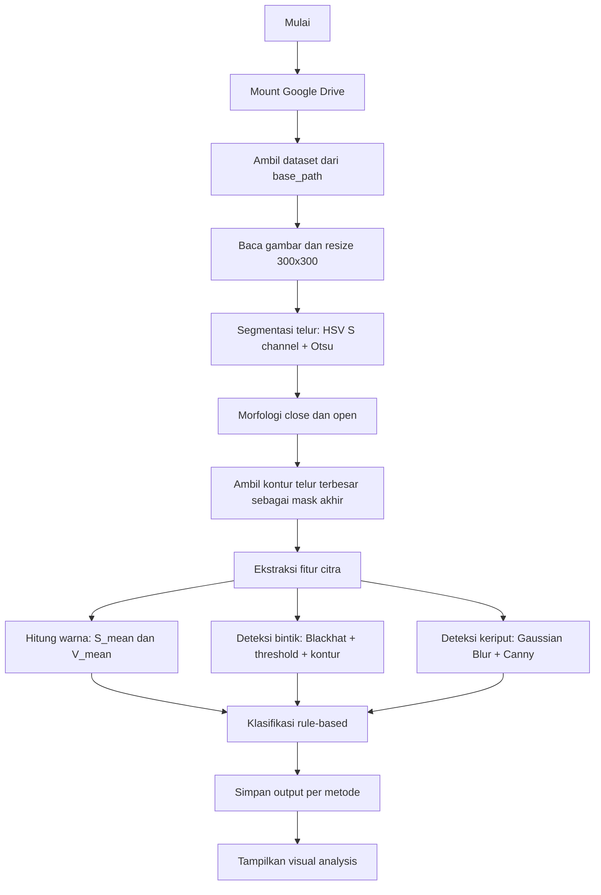

# Identifikasi Kesehatan Telur Unggas Berbasis Pengolahan Citra

Project ini berisi prototype analisis citra telur untuk membantu mengelompokkan kondisi telur ke beberapa kelas, yaitu `Sehat`, `Stres`, `Cacingan`, dan `Tua`. Alur program utama berada di `main.py` dan ditulis untuk dijalankan di Google Colab karena memakai `google.colab.drive`, `google.colab.files`, dan magic command `%matplotlib inline`.

Sistem tidak memakai training machine learning pada kode aktif saat ini. Klasifikasi dilakukan dengan pendekatan rule-based, yaitu keputusan dibuat dari nilai fitur citra yang diekstrak dari gambar telur.

## Ringkasan Alur Program



Secara garis besar, setiap gambar akan melewati langkah berikut:

1. Gambar dibaca sebagai RGB dan diubah ukurannya menjadi `300x300`.
2. Telur dipisahkan dari background menggunakan segmentasi berbasis HSV dan Otsu Thresholding.
3. Mask hasil segmentasi dibersihkan dengan operasi morfologi.
4. Program mengambil area telur terbesar agar background tidak ikut dianalisis.
5. Program menghitung fitur warna, bintik, dan tekstur/keriput.
6. Fitur dimasukkan ke fungsi klasifikasi rule-based.
7. Hasil tiap metode disimpan ke folder output di Google Drive.
8. Program menampilkan panel visual berisi gambar asli, segmentasi, fitur warna, bintik, keriput, dan keputusan sistem.

## Struktur File dan Folder

```text
citra_egg/
|-- main.py              # Program utama analisis citra telur
|-- main_backup.py       # Versi backup sebelum penambahan fitur keriput dan output
|-- test_otsu.py         # Script kecil untuk mencoba hasil Otsu normal vs inverse
|-- README.md            # Dokumentasi project
|-- dataset/             # Dataset lokal lama dengan folder angka 0-5
|-- sehat/               # Contoh gambar kategori sehat
|-- stres/               # Contoh gambar kategori stres
`-- cacingan/            # Contoh gambar kategori cacingan
```

Catatan penting: `main.py` saat ini membaca dataset dari Google Drive dengan path:

```python
base_path = "/content/drive/MyDrive/Citra_egg"
```

Di dalam path tersebut, fungsi testing mengharapkan folder:

```text
Citra_egg/
|-- Sehat/
|-- Setres/
|-- Cacingan/
`-- Tua/
```

Folder `Setres` memang dipetakan ke label model `Stres` di dalam kode.

## Kebutuhan Library

Install library berikut di Google Colab:

```bash
pip install opencv-python numpy pillow matplotlib ipython
```

Library yang dipakai:

- `opencv-python` / `cv2` untuk operasi pengolahan citra.
- `numpy` untuk perhitungan array dan rasio fitur.
- `Pillow` untuk membuka gambar dan mengubahnya ke RGB.
- `matplotlib` untuk membuat visualisasi analisis.
- `IPython.display` untuk menampilkan figure di notebook/Colab.
- `google.colab` untuk mount Drive dan upload file.

## Cara Menjalankan

Karena kode utama memakai fitur khusus Colab, jalankan `main.py` di Google Colab atau pindahkan isi kodenya ke cell notebook.

1. Upload project atau salin kode `main.py` ke Colab.
2. Pastikan folder dataset berada di:

```text
/content/drive/MyDrive/Citra_egg
```

3. Jalankan kode.
4. Program akan melakukan testing dataset lebih dulu dengan `run_testing(base_path)`.
5. Setelah itu program membuka upload dialog melalui `files.upload()`.
6. Gambar yang di-upload akan dianalisis satu per satu dengan `process_image()`.

Output metode akan tersimpan otomatis ke:

```text
/content/drive/MyDrive/Citra_egg/output/<Prediksi>/
```

Contoh struktur output:

```text
output/
|-- Sehat/
|   |-- 1_Original/
|   |-- 2_Segmentation/
|   |-- 3_Color_HSV/
|   |-- 4_Spot_Blackhat/
|   |-- 5_Texture_Canny/
|   `-- 6_Visual_Analysis/
|-- Stres/
|-- Cacingan/
`-- Tua/
```

## Penjelasan Fungsi Utama di `main.py`

### 1. `get_egg_mask(img_rgb)`

Fungsi ini bertugas membuat mask telur, yaitu gambar hitam-putih yang menandai area telur sebagai putih dan background sebagai hitam.

Alurnya:

1. Gambar RGB dikonversi ke HSV.
2. Program mengambil channel `S` atau saturation.
3. Channel `S` diproses dengan Otsu Thresholding.
4. Hasil threshold dibersihkan dengan morfologi close dan open.
5. Program mencari semua kontur.
6. Kontur dengan area terbesar dianggap sebagai objek telur.
7. Kontur terbesar digambar ulang sebagai `final_mask`.

Output fungsi ini adalah mask akhir yang hanya berisi area telur.

Metode yang dipakai:

- HSV Color Space
- Otsu Thresholding
- Morphological Closing
- Morphological Opening
- Contour Detection

### 2. `extract_features(img_rgb, mask)`

Fungsi ini mengambil angka-angka ciri dari area telur. Angka-angka inilah yang dipakai oleh fungsi klasifikasi.

Fitur yang dihasilkan:

- `S_mean`: rata-rata saturation pada area telur.
- `V_mean`: rata-rata brightness/value pada area telur.
- `spot_area_ratio`: perbandingan luas bintik terhadap luas telur.
- `bintik_count`: jumlah bintik valid yang ditemukan.
- `avg_spot_size`: rata-rata ukuran bintik.
- `edge_density`: kepadatan edge di area telur bagian dalam.

Fungsi ini juga mengembalikan:

- `spot_mask`: mask hasil deteksi bintik.
- `edges`: hasil deteksi edge/keriput.

### 3. `classify(f)`

Fungsi ini menentukan label akhir berdasarkan fitur citra. Parameter `f` adalah dictionary hasil `extract_features()`.

Urutan keputusan:

1. Jika `edge_density > 0.03`, telur diklasifikasikan sebagai `Tua`.
2. Jika `S_mean < 120` dan `V_mean > 150`, telur diklasifikasikan sebagai `Stres`.
3. Jika `spot_area_ratio > 0.02`, telur diklasifikasikan sebagai `Cacingan`.
4. Jika `bintik_count >= 6` dan `spot_area_ratio > 0.005`, telur diklasifikasikan sebagai `Cacingan`.
5. Jika `bintik_count >= 8`, telur diklasifikasikan sebagai `Cacingan`.
6. Jika tidak memenuhi semua aturan di atas, telur diklasifikasikan sebagai `Sehat`.

Fungsi ini mengembalikan dua nilai:

- Label prediksi, misalnya `Sehat`.
- Alasan keputusan, misalnya `Warna pucat (S rendah)`.

### 4. `save_output_images(pred, filename, img, mask, hsv_s, spot_mask, edges, fig=None, index=None)`

Fungsi ini menyimpan gambar hasil setiap metode ke Google Drive. Folder penyimpanan dibuat berdasarkan label prediksi.

Gambar yang disimpan:

- `1_Original`: gambar asli setelah dibaca dan di-resize.
- `2_Segmentation`: mask segmentasi telur.
- `3_Color_HSV`: channel saturation HSV.
- `4_Spot_Blackhat`: hasil deteksi bintik.
- `5_Texture_Canny`: hasil deteksi edge/keriput.
- `6_Visual_Analysis`: panel visual lengkap dari Matplotlib.

Format nama file dibuat otomatis:

```text
gambar<index>_<Prediksi>_<Metode>.<ext>
```

Contoh:

```text
gambar1_Sehat_Segmentation.jpg
gambar1_Sehat_VisualAnalysis.png
```

### 5. `process_image(path, filename=None, index=None)`

Fungsi ini menjalankan satu siklus analisis untuk satu gambar.

Alurnya:

1. Membaca gambar dari `path`.
2. Mengubah gambar ke RGB.
3. Resize gambar ke `300x300`.
4. Memanggil `get_egg_mask()` untuk segmentasi telur.
5. Memanggil `extract_features()` untuk mengambil fitur.
6. Memanggil `classify()` untuk menentukan label.
7. Membuat visualisasi 2 baris:
   - Baris pertama berisi gambar dan output metode.
   - Baris kedua berisi teks hasil analisis.
8. Menyimpan output dengan `save_output_images()`.
9. Menampilkan figure di Colab.
10. Mengembalikan label prediksi.

Fungsi ini dipakai untuk gambar yang di-upload manual melalui `files.upload()`.

### 6. `run_testing(base_path)`

Fungsi ini menguji semua gambar yang ada pada folder dataset di Google Drive.

Mapping folder ke label:

```python
folder_map = {
    "Sehat": "Sehat",
    "Setres": "Stres",
    "Cacingan": "Cacingan",
    "Tua": "Tua"
}
```

Alurnya:

1. Mengecek apakah `base_path` tersedia.
2. Membuka setiap folder pada `folder_map`.
3. Membaca semua file gambar di folder tersebut.
4. Melakukan segmentasi, ekstraksi fitur, dan klasifikasi.
5. Menyimpan output metode untuk setiap gambar.
6. Membandingkan prediksi dengan label folder.
7. Menampilkan hasil prediksi setiap file.
8. Menghitung akurasi sederhana:

```text
Accuracy = jumlah prediksi benar / total gambar
```

## Penjelasan Metode Pengolahan Citra

### RGB to HSV

Gambar awal dibaca dalam format RGB. Untuk segmentasi dan analisis warna, gambar dikonversi ke HSV.

HSV terdiri dari:

- `H` atau Hue: jenis warna.
- `S` atau Saturation: tingkat kemurnian/kepekatan warna.
- `V` atau Value: tingkat terang-gelap gambar.

Kode memakai channel `S` untuk segmentasi dan deteksi warna pucat, karena saturation lebih mudah menunjukkan perbedaan antara telur dan background dibanding langsung memakai RGB.

### Otsu Thresholding

Otsu Thresholding adalah metode untuk mencari nilai ambang secara otomatis. Program tidak menentukan nilai threshold secara manual untuk segmentasi telur. OpenCV mencari nilai batas terbaik dari distribusi intensitas channel `S`.

Pada kode:

```python
_, mask = cv2.threshold(s, 0, 255, cv2.THRESH_BINARY + cv2.THRESH_OTSU)
```

Hasilnya adalah citra biner:

- Putih `255` untuk area yang dianggap objek.
- Hitam `0` untuk area yang dianggap background.

### Morphological Closing

Closing dipakai setelah threshold untuk menutup lubang kecil di area objek telur.

Pada kode:

```python
mask = cv2.morphologyEx(mask, cv2.MORPH_CLOSE, kernel)
```

Efeknya:

- Area putih telur menjadi lebih utuh.
- Lubang kecil di dalam mask berkurang.
- Bentuk objek menjadi lebih stabil sebelum pencarian kontur.

### Morphological Opening

Opening dipakai setelah closing untuk menghapus noise kecil di luar objek telur.

Pada kode:

```python
mask = cv2.morphologyEx(mask, cv2.MORPH_OPEN, kernel)
```

Efeknya:

- Bintik putih kecil di background dikurangi.
- Objek kecil yang bukan telur dibuang.
- Mask menjadi lebih bersih.

### Contour Detection

Contour Detection dipakai untuk mencari garis tepi dari area putih hasil segmentasi.

Pada kode:

```python
cnts, _ = cv2.findContours(mask, cv2.RETR_EXTERNAL, cv2.CHAIN_APPROX_SIMPLE)
c = max(cnts, key=cv2.contourArea)
```

Program mengambil kontur paling besar karena objek utama diasumsikan sebagai telur. Setelah kontur terbesar ditemukan, program menggambarnya ke mask kosong sehingga area selain telur diabaikan.

### Masking

Masking berarti hanya memakai pixel yang berada di dalam area telur. Hampir semua fitur dihitung dengan syarat:

```python
mask > 0
```

Contoh:

```python
S = hsv[:,:,1][mask > 0]
V = hsv[:,:,2][mask > 0]
```

Dengan cara ini, nilai warna background tidak ikut mempengaruhi hasil analisis.

### Mean Saturation (`S_mean`)

`S_mean` adalah rata-rata nilai saturation di area telur.

Interpretasi pada kode:

- Nilai `S_mean` rendah berarti warna telur cenderung pucat.
- Jika `S_mean < 120` dan `V_mean > 150`, sistem memberi label `Stres`.

Fitur ini dipakai karena telur pada kondisi stres diasumsikan memiliki tampilan lebih pucat.

### Mean Value (`V_mean`)

`V_mean` adalah rata-rata nilai brightness pada area telur.

Fitur ini tidak berdiri sendiri sebagai keputusan akhir, tetapi dipakai bersama `S_mean`. Telur dianggap stres jika saturation rendah tetapi brightness masih cukup tinggi:

```python
if S < 120 and V > 150:
    return "Stres", "Warna pucat (S rendah)"
```

Kombinasi ini membantu membedakan telur pucat dari telur yang sekadar gelap karena pencahayaan.

### Blackhat Morphology

Blackhat Morphology digunakan untuk mendeteksi area gelap kecil pada permukaan telur, misalnya bintik.

Pada kode:

```python
kernel = cv2.getStructuringElement(cv2.MORPH_ELLIPSE, (9,9))
blackhat = cv2.morphologyEx(gray, cv2.MORPH_BLACKHAT, kernel)
blackhat = cv2.bitwise_and(blackhat, blackhat, mask=mask)
```

Cara kerjanya:

- Gambar dikonversi ke grayscale.
- Operasi blackhat menonjolkan detail gelap yang lebih kecil dari kernel.
- Hasilnya dibatasi hanya pada area telur memakai mask.

Metode ini cocok untuk mencari bintik karena bintik biasanya terlihat lebih gelap daripada permukaan telur di sekitarnya.

### Threshold Bintik

Setelah blackhat, program mengubah hasilnya menjadi citra biner dengan threshold tetap `12`.

```python
_, spot_mask = cv2.threshold(blackhat, 12, 255, cv2.THRESH_BINARY)
```

Pixel yang lebih kuat dari nilai 12 dianggap sebagai kandidat bintik. Nilai ini adalah parameter manual yang bisa disesuaikan jika pencahayaan atau kualitas kamera berubah.

### Median Blur

Median Blur dipakai untuk merapikan `spot_mask`.

```python
spot_mask = cv2.medianBlur(spot_mask, 3)
```

Efeknya:

- Mengurangi noise kecil.
- Menjaga bentuk bintik lebih baik dibanding blur rata-rata.
- Membuat hasil kontur bintik lebih stabil.

### Filtering Kontur Bintik

Setelah `spot_mask` dibuat, program mencari kontur bintik dan hanya menerima bintik dengan area tertentu.

```python
if 10 < area < 500:
    valid.append(c)
    spot_area += area
```

Tujuannya:

- Area terlalu kecil dianggap noise.
- Area terlalu besar dianggap bukan bintik normal.
- Hanya bintik valid yang dihitung sebagai fitur.

Hasil dari tahap ini dipakai untuk menghitung:

- `bintik_count`
- `spot_area_ratio`
- `avg_spot_size`

### Spot Area Ratio

`spot_area_ratio` adalah perbandingan total area bintik terhadap total area telur.

```python
spot_area_ratio = spot_area / (egg_area + 1e-6)
```

Nilai `1e-6` ditambahkan agar tidak terjadi pembagian dengan nol.

Interpretasi pada kode:

- Jika `spot_area_ratio > 0.02`, sistem memberi label `Cacingan`.
- Jika jumlah bintik banyak dan rasionya melewati `0.005`, sistem juga memberi label `Cacingan`.

### Erosion Mask

Sebelum mendeteksi keriput, mask telur dikikis sedikit dengan erosion.

```python
erode_kernel = np.ones((15,15), np.uint8)
eroded_mask = cv2.erode(mask, erode_kernel, iterations=1)
```

Tujuannya adalah mengurangi tepi luar telur agar Canny tidak menghitung pinggiran telur sebagai keriput. Dengan erosion, analisis edge lebih fokus ke permukaan bagian dalam telur.

### Gaussian Blur

Gaussian Blur dipakai sebelum Canny Edge Detection.

```python
blurred = cv2.GaussianBlur(gray, (5, 5), 0)
```

Efeknya:

- Menghaluskan noise kamera.
- Membuat deteksi edge tidak terlalu sensitif terhadap titik kecil.
- Membantu Canny menghasilkan edge yang lebih relevan.

### Canny Edge Detection

Canny dipakai untuk mendeteksi garis atau kerutan pada permukaan telur.

```python
edges = cv2.Canny(blurred, 40, 120)
edges = cv2.bitwise_and(edges, edges, mask=eroded_mask)
```

Nilai `40` dan `120` adalah threshold bawah dan atas untuk deteksi edge. Setelah edge ditemukan, hasilnya dibatasi dengan `eroded_mask` supaya hanya edge di dalam area telur yang dihitung.

### Edge Density

`edge_density` menghitung seberapa padat edge di area telur bagian dalam.

```python
edge_density = np.sum(edges > 0) / (np.sum(eroded_mask > 0) + 1e-6)
```

Interpretasi pada kode:

- Jika `edge_density > 0.03`, telur diberi label `Tua`.
- Alasannya: telur tua diasumsikan memiliki permukaan lebih keriput atau bertekstur, sehingga jumlah edge lebih banyak.

## Aturan Klasifikasi

Klasifikasi dilakukan berurutan. Aturan yang lebih atas memiliki prioritas lebih tinggi.

| Prioritas | Kondisi | Label | Alasan |
| --- | --- | --- | --- |
| 1 | `edge_density > 0.03` | `Tua` | Permukaan keriput, edge density tinggi |
| 2 | `S_mean < 120` dan `V_mean > 150` | `Stres` | Warna pucat |
| 3 | `spot_area_ratio > 0.02` | `Cacingan` | Area bintik besar |
| 4 | `bintik_count >= 6` dan `spot_area_ratio > 0.005` | `Cacingan` | Bintik banyak |
| 5 | `bintik_count >= 8` | `Cacingan` | Bintik sangat banyak |
| 6 | Selain kondisi di atas | `Sehat` | Warna normal, permukaan halus, dan bintik sedikit |

Karena memakai aturan manual, akurasi sangat bergantung pada:

- Kualitas pencahayaan gambar.
- Background foto.
- Jarak kamera.
- Warna asli telur.
- Nilai threshold yang dipakai di kode.

## Penjelasan Output Visual

Panel visual dari `process_image()` terdiri dari lima gambar metode dan satu area teks analisis.

### Original Image

Menampilkan gambar input setelah resize menjadi `300x300`. Gambar ini menjadi acuan untuk membandingkan hasil metode lain.

### Segmentation

Menampilkan mask telur hasil HSV, Otsu, morfologi, dan kontur terbesar. Area putih adalah area yang dianalisis sebagai telur.

### Color Feature (S)

Menampilkan channel saturation dari HSV. Bagian ini dipakai untuk melihat tingkat kepekatan warna telur. Nilai rata-ratanya menjadi `S_mean`.

### Spot Detection

Menampilkan bintik hasil Blackhat Morphology dan threshold. Area terang pada visual ini adalah kandidat bintik yang terdeteksi.

### Texture/Wrinkles

Menampilkan hasil Canny Edge Detection pada area dalam telur. Semakin banyak garis putih, semakin tinggi nilai `edge_density`.

### Hasil Analisis Sistem

Bagian teks menampilkan:

- Nilai `S_mean`.
- Interpretasi warna.
- Jumlah bintik.
- Rata-rata ukuran bintik.
- Rasio area bintik.
- Nilai `edge_density`.
- Diagnosis akhir.
- Alasan keputusan.
- Daftar metode yang digunakan.

## Catatan Pengembangan

Beberapa hal yang perlu diperhatikan jika project dikembangkan lagi:

- `main.py` belum bisa langsung dijalankan sebagai script Python biasa karena ada `%matplotlib inline` dan dependency `google.colab`.
- Nilai threshold seperti `S < 120`, `V > 150`, `spot_area_ratio > 0.02`, dan `edge_density > 0.03` masih berbasis aturan manual.
- Dataset lokal `dataset/0` sampai `dataset/5` belum dipakai langsung oleh `main.py`.
- Jika ingin memakai dataset lokal, `base_path` dan `folder_map` perlu disesuaikan.
- Jika ingin memakai machine learning, fitur dari `extract_features()` dapat dikumpulkan menjadi tabel lalu dilatih memakai model seperti KNN, SVM, Random Forest, atau Decision Tree.
